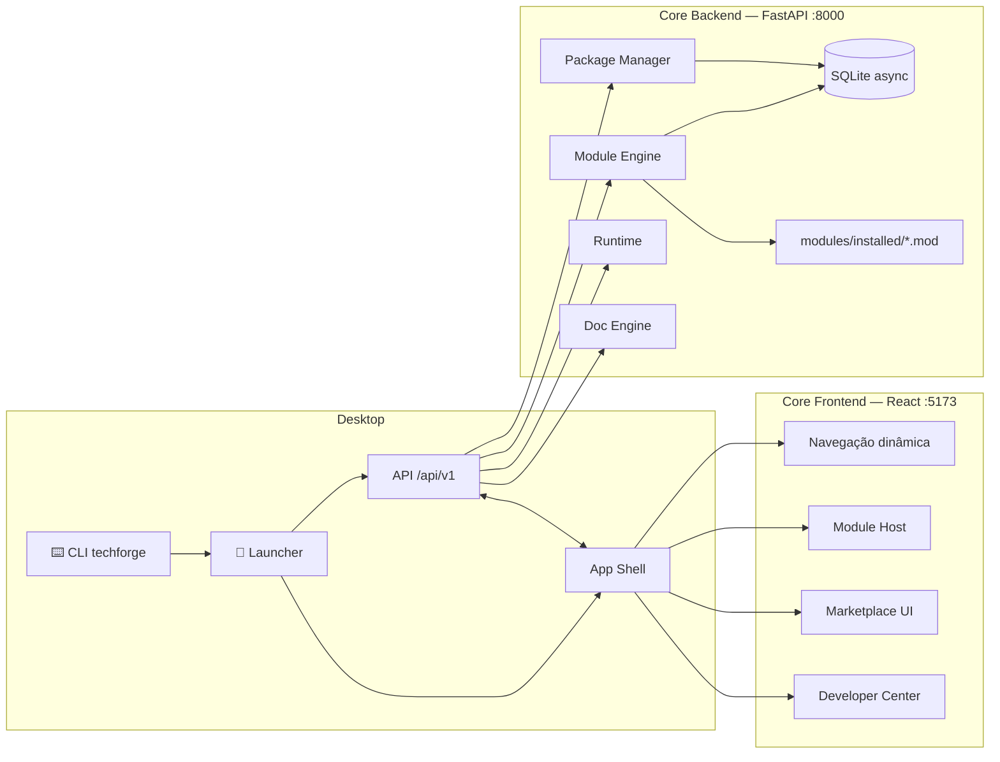
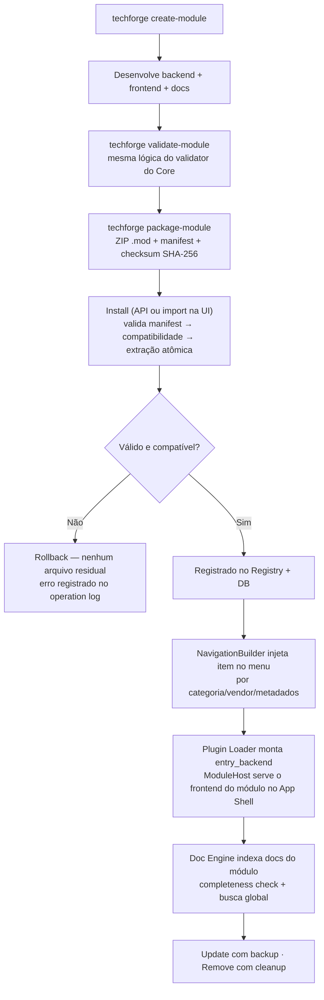

<div align="center">

# ⚒️ TechForge

**A modular platform engine for technical & business tools.**

Build once as a module — install, run and document it inside a single lightweight desktop platform.

[](https://www.python.org/)
[](https://fastapi.tiangolo.com/)
[](https://react.dev/)
[](https://www.typescriptlang.org/)
[](https://www.sqlite.org/)
[](#-testes)
[](LICENSE)
[](#-contribuindo)

</div>

---

## ✨ O que é o TechForge?

TechForge é uma **plataforma core modular, local-first e otimizada para desktop**, feita para hospedar ferramentas técnicas e comerciais como **módulos plugáveis**: sizing de backup, health checks de virtualização, análise de leads, integrações cloud — qualquer ferramenta interna pode se tornar um módulo.

O Core é **pequeno e estável**. Toda funcionalidade de negócio vive em módulos com ciclo de vida completo:

```text
descoberta → validação → registro → instalação → execução → documentação → remoção
```

### Por que não uma app monolítica? Por que módulos?

| Monólito tradicional | TechForge |
|---|---|
| Cada ferramenta é um projeto separado | Todas as ferramentas em **uma única plataforma** |
| UI, auth, config e logs duplicados a cada app | Infraestrutura compartilhada: shell, navegação, package manager, docs |
| Deploy e atualização manuais por ferramenta | `.mod` empacotado, instalado e atualizado com rollback |
| Conhecimento espalhado | **Documentation Engine** indexa tudo, com busca e contexto p/ IA |

### Este repositório é só a plataforma — os módulos ficam à parte

Este repositório (`Tech.Forge`) contém **só o Core**: o motor que carrega,
executa e gerencia módulos. Ele **não vem com módulos de negócio prontos**
(fora dois exemplos de referência usados internamente para testes).

Os módulos reais — as ferramentas que você de fato usa dentro da
plataforma — vivem num catálogo separado:
**[`Tech.Forge.Modules`](https://github.com/julianscunha/Tech.Forge.Modules)**.
Se você quer ver o que já existe pra instalar, ou criar um módulo novo,
é lá que você deve ir depois de ter o Core rodando.

---

## 🏗️ Arquitetura



### O fluxo de um módulo



---

## 📦 Estrutura do Projeto

```text
TechForge/
├── core/
│   ├── backend/app/
│   │   ├── api/routes/        # Rotas FastAPI (/api/v1/*)
│   │   ├── module_engine/     # manifest · validator · registry · loader · plugin_loader
│   │   ├── package_manager/   # install/remove/update/import · compatibilidade · log
│   │   ├── doc_engine/        # indexação · busca · contratos API · completeness
│   │   ├── runtime/           # estado da plataforma (status/eventos)
│   │   ├── models/ schemas/   # SQLAlchemy + pydantic
│   │   └── core/              # settings centralizado (env vars)
│   └── frontend/src/
│       ├── pages/             # Dashboard · Modules · Marketplace · Developer Center
│       ├── components/        # AppShell · Sidebar · ModuleHost · LoaderJournal
│       └── store/             # zustand (nav, tema, sidebar)
├── modules/
│   ├── repository/            # Catálogo local de pacotes .mod
│   ├── installed/             # Módulos instalados (hello_world de exemplo)
│   └── cache/                 # Cache de downloads
├── launcher/                  # Splash · single-instance · health-readiness · shutdown ordenado
├── cli/techforge_cli/         # create/validate/package-module · platform start/stop/status
├── sdk/python/                # SDK para desenvolvedores de módulos
├── docs/                      # INDEX.md · phases/ · developer-center/ · architecture.md
├── config/                    # .env
└── tests/ → core/backend/tests/  # 721 testes pytest (unit/integration/contract/e2e/smoke)
```

---

## 🚀 Quick Start

### Pré-requisitos

- Python 3.11+
- Node.js 18+

### Um comando (via launcher)

```bash
pip install -e cli
techforge platform start     # sobe backend + frontend + abre o browser
techforge platform status    # verifica saúde
techforge platform stop      # shutdown ordenado
```

> O launcher garante instância única (pidfile), espera o backend ficar pronto por
> health check (não por sleep), loga tudo em `logs/` e só mata PIDs que ele mesmo criou.

### Manual

<details>
<summary><b>Backend</b></summary>

```bash
cd core/backend
python -m venv .venv && .venv/Scripts/pip install -r requirements.txt
python run.py
# API      → http://127.0.0.1:8000
# Swagger  → http://127.0.0.1:8000/api/docs
# Health   → GET /api/v1/platform/health  {status, platform, version}
```

⚠️ Rode sempre a partir de `core/backend/` — o caminho do SQLite é relativo ao CWD.
</details>

<details>
<summary><b>Frontend</b></summary>

```bash
cd core/frontend
npm install
npm run dev          # http://localhost:5173
npm run build        # tsc -b && vite build
npm run lint         # zero-warnings policy
```
</details>

<details>
<summary><b>Configuração (.env)</b></summary>

Todas as variáveis em um único lugar (`config/.env`, ver `config/.env.example`).
Nada de URLs/portas/caminhos hardcoded no código.

```env
PLATFORM_NAME=TechForge
PLATFORM_VERSION=1.0.0
HOST=127.0.0.1
PORT=8000
DATABASE_URL=sqlite+aiosqlite:///.../config/techforge.db
CORS_ORIGINS=["http://localhost:5173"]
```

Trocar `DATABASE_URL` prepara migração futura para PostgreSQL — dependências
específicas de SQLite ficam isoladas na camada de dados.
</details>

---

## 🧩 Criando seu primeiro módulo

Todo módulo é um pacote `.mod` (ZIP) com um `manifest.yaml` declarativo:

```yaml
id: hello_world
name: Hello World
version: 1.0.0
module_type: service          # application | service
category: examples
vendor: TechForge
entry_backend: api.routes:router      # router FastAPI montado pelo Plugin Loader
entry_frontend: main.js               # carregado no Module Host dentro do App Shell
documentation:
  overview: docs/overview.md
compatibility:
  platform_min_version: "1.0.0"
```

```bash
techforge create-module meu_modulo      # scaffold completo
techforge validate-module ./meu_modulo  # mesma lógica do Core validator
techforge package-module ./meu_modulo   # gera meu_modulo.mod (ZIP assinável)
# Instale pela UI: Marketplace → Import .mod
```

O módulo aparece automaticamente na navegação, seus endpoints são montados
sob `/api/v1` e sua documentação entra no índice com score de completude.

---

## 🔌 API Reference

<details open>
<summary><b>Platform & Runtime</b></summary>

| Method | Path | Descrição |
|--------|------|-----------|
| GET | `/api/v1/platform/health` | Health check da spec (status/platform/version/db) |
| GET | `/api/v1/platform/status` | Status + contadores (dashboard) |
| GET | `/api/v1/runtime/status` | Estado runtime (bootstrapping/ready/shutting_down) |
| GET | `/api/v1/health` | Saúde por módulo registrado |

</details>

<details>
<summary><b>Modules & Registry</b></summary>

| Method | Path | Descrição |
|--------|------|-----------|
| GET | `/api/v1/modules` | Lista módulos instalados |
| POST | `/api/v1/modules` | Registra módulo |
| GET | `/api/v1/modules/:id` | Detalhe do módulo |
| GET | `/api/v1/registry/navigation` | Árvore de navegação por metadados |
| GET | `/api/v1/categories` · POST · GET/:slug | Categorias |

</details>

<details>
<summary><b>Marketplace / Package Manager</b></summary>

| Method | Path | Descrição |
|--------|------|-----------|
| GET | `/api/v1/marketplace/installed·available·updates` | Catálogo local |
| POST | `/api/v1/marketplace/install/:module_id` | Instalação validada com rollback |
| DELETE | `/api/v1/marketplace/remove/:module_id` | Remoção física + cleanup |
| POST | `/api/v1/marketplace/update/:module_id` | Atualização com backup |
| POST | `/api/v1/marketplace/import` | Importar .mod por upload |
| POST | `/api/v1/marketplace/compatibility` | Verificação de compatibilidade |
| GET | `/api/v1/marketplace/log` | Operation log |
| POST | `/api/v1/marketplace/install-remote/:module_id` | Instalação remota assíncrona (retorna job) |
| GET | `/api/v1/marketplace/install-jobs/:job_id` | Polling de progresso da instalação remota |

</details>

<details>
<summary><b>Catálogo de Módulos (Fase 11 — multi-fonte)</b></summary>

| Method | Path | Descrição |
|--------|------|-----------|
| GET | `/api/v1/catalog/modules` | Lista módulos de todas as fontes (local + oficial + custom), com filtros/paginação |
| GET | `/api/v1/catalog/modules/:module_id` | Detalhe de um módulo do catálogo |
| GET | `/api/v1/catalog/categories` | Categorias com contagem |
| GET | `/api/v1/catalog/updates` | Módulos instalados com atualização disponível |
| GET/POST | `/api/v1/catalog/sources` | Lista/adiciona fontes customizadas |
| DELETE | `/api/v1/catalog/sources/:id` | Remove fonte customizada |
| GET/POST/DELETE | `/api/v1/catalog/favorites` | Favoritos locais (sem avaliação pública) |

</details>

<details>
<summary><b>Configuration & Persistence (Fase 12)</b></summary>

| Method | Path | Descrição |
|--------|------|-----------|
| GET | `/api/v1/system/storage/status` | Saúde do storage (leitura + escrita) |
| GET | `/api/v1/system/migrations/status` | Head vs. revisão atual do Alembic |
| GET | `/api/v1/config` | Configuração de plataforma efetiva (também serve de export) |
| GET/PUT | `/api/v1/modules/:module_id/config` | Configuração de módulo (schema do manifest, validada) |
| POST | `/api/v1/modules/:module_id/config/validate` | Valida sem persistir |

</details>

<details>
<summary><b>Quality & Release Engineering (Fase 15)</b></summary>

| Method | Path | Descrição |
|--------|------|-----------|
| GET | `/api/v1/system/version` | Versão da plataforma (fonte única: `PLATFORM_VERSION`) |
| GET | `/api/v1/release/readiness` | Release Readiness Report (versão, changelog, docs, migrations, storage) |
| GET | `/api/v1/modules/:module_id/quality` | Module Quality Report (status, docs, compatibilidade, contrato) |
| GET | `/api/v1/modules/:module_id/release-readiness` | Mesmo dado do quality, framing de gate |

CLI: `techforge version` · `techforge release-check [--skip-tests] [--skip-build]` ·
`techforge modules quality <id>` · `techforge modules release-check <id>`.

</details>

<details>
<summary><b>Notifications</b></summary>

| Method | Path | Descrição |
|--------|------|-----------|
| GET | `/api/v1/notifications?unread_only=&limit=` | Lista notificações (mais recentes primeiro) |
| POST | `/api/v1/notifications` | Cria `{level: info\|warning\|error\|success, title, message?}` |
| GET | `/api/v1/notifications/unread-count` | Contador de não lidas (badge do bell) |
| POST | `/api/v1/notifications/:id/read` · `/read-all` | Marcar como lida |
</details>

<details>
<summary><b>Documentation Engine</b></summary>

| Method | Path | Descrição |
|--------|------|-----------|
| GET | `/api/v1/docs/summary` · `/list` · `/article/:path` | Documentação indexada |
| GET | `/api/v1/docs/search?q=` | Busca com ranking |
| GET | `/api/v1/docs/contracts[/:module_id]` | Contratos de serviço tipados (API yaml) |
| GET | `/api/v1/docs/completeness[/:module_id]` | Compliance de docs por módulo |
| GET | `/api/v1/docs/export/ai-context` | Exporta contexto para LLMs |
| POST | `/api/v1/docs/reindex` | Reconstrói o índice |

</details>

---

## 🗺️ Roadmap

Fases detalhadas em [`docs/phases/`](docs/phases/) · auditoria real em [`tasks/phase-audit.md`](tasks/phase-audit.md).

```mermaid
gantt
    dateFormat X
    axisFormat %s
    section Fundação
    Fase 1 Foundation ✓         :done, 0, 1
    Fase 2 Core Architecture ✓  :done, 0, 1
    Fase 3 Module System ✓      :done, 0, 1
    section Plataforma
    Fase 4 Marketplace/PkgMgr ✓ :done, 1, 2
    Fase 5 Developer Center ✓   :done, 1, 2
    Fase 6 Launcher/Runtime ✓   :done, 1, 2
    Fase 7 Doc Compliance ✓     :done, 1, 2
    section Ecossistema
    Fase 8 Service Registry ✓          :done, 2, 3
    Fase 8.1 Dependency Governance ✓   :done, 2, 3
    Fase 9 Module Runtime ✓             :done, 3, 4
    Fase 10 Security & Trust ✓          :done, 4, 5
    Fase 11 Marketplace Distribution ✓  :done, 5, 6
    Fase 12 Configuration & Persistence ✓ :done, 6, 7
    Fase 15 Quality & Release Engineering ✓ :done, 7, 8
    section Adiado / condicionado
    Fase 13 Central Server Multi-User (adiada) :7, 9
    Fase 14 Observability                 :active, 8, 9
    Fase 16-20                            :9, 11
```



**Próximos marcos** (decididos por auditoria contra código real,
ver [`tasks/phase-audit.md`](tasks/phase-audit.md)):
- Observability, Telemetry & Diagnostics (Fase 14) — ordem recomendada 15→**14**→16→17→18
- Fase 13 (Central Server/Multi-User) e 18.1/19/20 (ecossistema externo público) ficam adiadas até decisão explícita de negócio — foco atual é otimizar a experiência single-user/Desktop

---

## 🤝 Contribuindo

A comunidade mantém o ecossistema **através de módulos** — o Core permanece pequeno de propósito.

1. Fork → branch → `techforge create-module`
2. Siga o guia: [`docs/developer-center/guides/development-guide.md`](docs/developer-center/guides/development-guide.md)
3. Valide docs: `GET /api/v1/docs/completeness/<seu-modulo>` deve passar
4. Rode os testes antes do PR:

```bash
cd core/backend && .venv/Scripts/python.exe -m pytest tests -q
cd core/frontend && npm run lint && npm run build
```

## 📖 Documentação

| Doc | Conteúdo |
|---|---|
| [`docs/INDEX.md`](docs/INDEX.md) | Índice categorizado de toda a documentação |
| [`docs/architecture.md`](docs/architecture.md) | Arquitetura do Core |
| [`docs/developer-center/guides/core-development-setup.md`](docs/developer-center/guides/core-development-setup.md) | Setup do Core |
| [`docs/phases/`](docs/phases/) | Specs das 22 fases (escopo + critérios de aceitação) |
| [`docs/developer-center/`](docs/developer-center/) | Guias, referência do manifest, exemplos |

---

<div align="center">
<sub>TechForge — Local first. Modular by design. Lean by principle.</sub>
</div>
