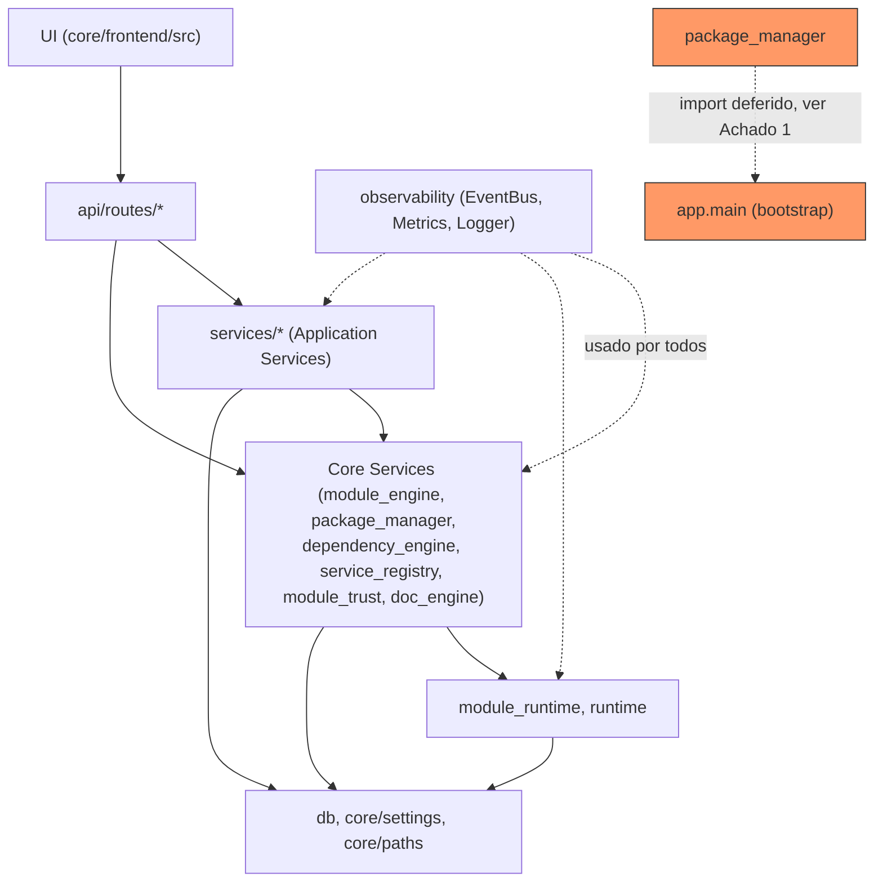

# TechForge Core — Dependency Map

> Fase 18, Slice 1. Gerado a partir de imports reais
> (`ast-grep outline --items imports` sobre `core/backend/app/`), não
> hipotético. Ver também [`core-inventory.md`](core-inventory.md).

## Camadas (real, não aspiracional)



A camada real segue majoritariamente `UI → API → Services/Core Services
→ Runtime → Infrastructure`, como o CLAUDE.md descreve. `observability`
é transversal por design (todo componente publica eventos/métricas
nela) — não é uma violação, é a natureza de um barramento de eventos.

## Achado 1 — `package_manager` importa `app.main` (inversão de camada)

`core/backend/app/package_manager/lifecycle.py:147`, dentro de
`activate_module()`:

```python
from app.main import app
from app.module_engine.plugin_loader import mount_module_routers
mount_module_routers(app)
```

Import **deferido** (dentro da função, não top-level) — não quebra o
boot nem cria erro de import circular em tempo de carregamento do
módulo Python. Mas conceitualmente é uma inversão: `package_manager` é
uma Core Service; `app.main` é a camada de bootstrap/Infrastructure
mais alta (dona do `FastAPI()` app e do `lifespan`). Package Manager
precisa da instância viva do `app` pra montar o router de um módulo
recém-ativado sem reiniciar o processo (hot activation).

**Classificação**: acoplamento oculto real, mas funcionalmente
necessário dado que não há reinício de processo na ativação — não tem
solução óbvia mais barata sem introduzir um padrão de registro de
router mais indireto (ex.: `app` injetado via `Depends`/estado
compartilhado). Vira item no Technical Debt Registry (Slice 9); não
corrigido nesta fase (spec §48 pede não reescrever componentes
estáveis sem necessidade).

## Achado 2 — rotas acessando `models.*` diretamente, pulando o service

Três arquivos de rota importam `app.models.notifications.Notification`
(ORM) direto, além de já usarem `NotificationService` pra tudo mais:

- `api/routes/docs.py:20` (endpoint de reindex cria notificação inline)
- `api/routes/notifications.py:62` (`mark_read`/leitura em lote)
- `api/routes/marketplace.py:322` (fluxo de instalação remota)

**Classificação**: inconsistência menor, não crítica — `NotificationService`
existe e é o caminho oficial, mas 3 call-sites specific fazem `select()`
direto no model em vez de adicionar o método que falta ao serviço.
Duplicação pequena (mesmo padrão de query repetido 3x fora do
serviço). Candidato a limpeza de baixo risco, registrado como débito
técnico (Slice 9) em vez de tocado às cegas aqui.

## Achado 3 — `api/routes/security.py` importa de `api/routes/module_verification.py`

```python
# api/routes/security.py:14
from app.api.routes.module_verification import list_modules_trust
```

Uma rota reaproveitando a função-handler de outra rota como se fosse
um serviço. Funciona (Python não liga pra isso), mas é rota→rota em
vez de rota→serviço — `list_modules_trust` deveria idealmente viver em
`services/` e ser chamada por ambos os routers. Achado real, baixo
risco, registrado como débito técnico.

## Achado 4 — colisão de nome `RuntimeState` (dois enums distintos)

- `app/runtime/__init__.py::RuntimeState` — estado da **plataforma**
  (`BOOTSTRAPPING`, `READY`, `DEGRADED`, `SHUTTING_DOWN`, `STOPPED`).
- `app/module_runtime/state.py::RuntimeState` — estado de execução de
  **um módulo** (`READY`, `INITIALIZING`, `EXECUTING`, `DEGRADED`,
  `FAILED`, `STOPPED`).

Não é um bug (namespaces diferentes, sempre importados qualificados,
nenhum teste falha) — mas é o mesmo padrão de nomenclatura próxima já
documentado no `phase-audit.md` pra `runtime_id`/`execution_id`
(Fases 9/14): dois conceitos parecidos, nomes idênticos, camadas
diferentes. Registrar como nota de nomenclatura no Technical Debt
Registry — não renomear agora (romperia callers/testes existentes sem
ganho funcional, mesma decisão já tomada pro par runtime_id/execution_id).

## Nenhum ciclo de import real encontrado

`package_manager` importa de `module_engine`; `module_engine` não
importa de volta de `package_manager` (confirmado — outline de
`module_engine/*` não retorna nenhuma linha com `package_manager`).
`dependency_engine`, `service_registry` e `module_trust` são
consumidos por `package_manager`/`api/routes`, mas não importam de
volta desses consumidores. O único "ciclo" real é o Achado 1
(`package_manager → app.main`, deferido, sem crash).

## Nenhum resolver/registry duplicado encontrado

- Module Registry: só `module_engine.registry.registry` (singleton),
  confirmado — nenhum outro dict/registro paralelo de módulos instalados
  encontrado em `api/routes` ou `services`.
- Dependency Resolver: só `dependency_engine.resolver.DependencyResolver`
  — usado por `api/routes/dependencies.py` e `package_manager`, nenhuma
  cópia paralela pra UI/Installer.
- Service Registry: só `service_registry.registry.service_registry`.

Consistente com a regra "fonte única de verdade" do CLAUDE.md — as
Fases 8/8.1/9/10 já foram fechadas com essa exigência, e a Fase 18 só
confirma que continua verdade, sem achado de duplicação real aqui.
