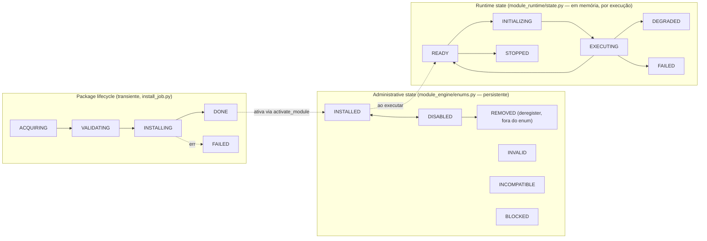

# TechForge Core — Public Contracts Inventory

> Catálogo construído a partir do código real (`ast-grep outline` sobre
> `core/backend/app/`), não da lista de exemplo da spec de arquitetura —
> os nomes abaixo são os nomes reais das classes quando divergem do
> exemplo. Ver também [`core-inventory.md`](core-inventory.md) e
> [`dependency-map.md`](dependency-map.md).

## Catálogo

| Contrato (nome real) | Propósito | Localização | Assinatura pública (resumo) | Estabilidade | Consumidores conhecidos |
|---|---|---|---|---|---|
| `ParsedManifest` (§7: "ModuleManifest") | Manifesto de módulo já parseado e validado | `module_engine/manifest.py:43` | Dataclass: `id, name, version, category, entry_backend, entry_frontend, module_type, dependencies, configuration_fields, ...` | **Stable** — schema usado desde a Fase 2, só cresceu por campos opcionais (versioning docs na Fase 17, `module_type` na Fase 8.1) | `ModuleLoader`, `ModuleEntry.from_manifest`, `PackageBuilder`, `PackageManager.install` |
| `ModuleExecutionContext` | Contexto injetado num módulo em execução (storage, secrets, paths, logger, ids) | `module_runtime/context.py:25` | Dataclass: `module_id, module_version, runtime_id, execution_id, configuration, services, logger, paths, storage, secrets, cancellation, metadata` + `build()` (classmethod async) | **Stable** — introduzido na Fase 8/12, campos só adicionados (storage na Fase 12, secrets na Fase 17) | `service_registry.invoker`, `lifecycle.on_activate/on_deactivate/health_check`, módulos de exemplo |
| `ServiceContract` | Contrato público de um Service Module (exports, capabilities, versão) | `doc_engine/models.py:84` | Dataclass: `service_id, module_id, description, version="1.0.0", exports: list[ServiceExport], dependencies, capabilities, raw` | **Stable** — tem campo `version` próprio desde a criação (Fase 8), já nasceu versionado | `service_registry.invoker` (via manifest `raw`), `api/routes/services.py`, `api/routes/docs.py` |
| `Dependency` (§7: "DependencyContract") | Dependência declarada no manifest, já parseada (tipo + alvo + faixa de versão) | `dependency_engine/models.py:31` | Dataclass: `target_type: TargetType, target_id, version_range, required: bool` | **Stable** — schema fixo desde a Fase 8.1, sem mudança de assinatura reportada | `DependencyParser`, `DependencyValidator`, `DependencyGraph`, `DependencyResolver` |
| `StorageProvider` | Health-check de armazenamento (DB acessível + gravável) | `db/storage.py:21` | `async health_check(db) -> StorageHealth` | **Stable** — superfície mínima e estável desde a Fase 6/14 | `services/system_diagnostics.py`, rota `/diagnostics` |
| `SecretStoreBackend` / `ModuleSecretStore` (§7: "SecretProvider") | Cofre de segredos por módulo, isolado via `module_id`, backend plugável (keyring) | `security/secret_store.py:28` (ABC) / `:79` (facade) | ABC: `get/set/delete(module_id, key)`; Facade: `ModuleSecretStore(module_id).get/set/rotate/delete(key)` | **Stable** — contrato fechado na Fase 17 (Security Hardening), sem consumidor além do keyring hoje | `ModuleExecutionContext.secrets`, `SecretRedactionFilter` (observability) |
| `EventBus` | Barramento de eventos pub/sub genérico e síncrono | `observability/events.py:33` | `subscribe(event_type, fn)`, `publish(Event)` | **Stable** — infraestrutura transversal desde a Fase 14, sem mudança de assinatura | `notifications_bridge`, `runtime` (platform state), `module_runtime.lifecycle`, `package_manager` |
| `MetricEmitter` | Emissor de métricas in-memory (Counter/Gauge/Histogram/Timer) | `observability/metrics.py:85` | `counter(name)`, `gauge(name)`, `histogram(name)`, `timer(name)` — cada um retorna o objeto de métrica correspondente | **Stable** — desde a Fase 14, consumido amplamente sem mudança de API | `dependency_engine.validator`, `service_registry.invoker`, diagnostics |
| `SystemDiagnosticService` (§7: "DiagnosticProvider") | Agregação de diagnóstico da plataforma (storage + runtime + módulos) pro snapshot de `/diagnostics` | `services/system_diagnostics.py` | Serviço de aplicação (não uma interface abstrata) — consome `StorageProvider`, `runtime`, `module_runtime_registry`, Error Registry | **Experimental** — é uma classe de serviço concreta, não uma interface pluggable como os outros "Provider" da lista; não há um segundo diagnostic backend hoje. Nome do §7 ("DiagnosticProvider") sugere uma abstração que ainda não existe — registrar como candidato a formalizar só se surgir um segundo consumidor real |

**Nota sobre os nomes do §7 da spec vs. código real**: a spec usa nomes de exemplo (`ModuleManifest`, `DependencyContract`, `DiagnosticProvider`) que não correspondem 1:1 a classes do código. Isso é esperado — o próprio §7 os apresenta como "Exemplo". Mantivemos o catálogo pelos nomes reais para que o documento seja verificável contra o código, com a correspondência ao termo da spec entre parênteses.

## Contract versioning policy (§8)

Adotada nesta slice, sem mudança de comportamento:

- **Stable** — mudança de assinatura exige depreciação anunciada antes da remoção (ver `deprecation-and-migration` quando essa fase existir). É o padrão pra contratos em uso desde fases fechadas sem histórico de breaking change.
- **Experimental** — mudanças podem ocorrer com aviso em release notes, sem ciclo de depreciação formal. Reservado a contratos que ainda não têm um segundo consumidor real provando a abstração.
- **Deprecated** — não aplicável no momento (nenhum ciclo de remoção em andamento). Nenhum contrato do catálogo foi classificado assim.

Apenas `SystemDiagnosticService` recebeu classificação Experimental; todos os demais são Stable.

## Application → Service direction (§9)

Regra implementada em `dependency_engine/validator.py:_check_direction` — aplicada
apenas quando `module_type == "service"` (Service Module) e o alvo já está
instalado:

```
Application Module ──pode depender de──> Service Module     (permitido)
Service Module     ──depender de──> Application Module      (INVALID_DEPENDENCY_DIRECTION)
```

**Validado contra os 3 módulos instalados reais**:

| Módulo | `module_type` | Depende de | Direção |
|---|---|---|---|
| `hello_world` | service | — (nenhuma dependência declarada) | N/A |
| `system_information_service` | service | — (nenhuma dependência declarada) | N/A |
| `system_health_check` | application | `system_information_service` (service, required) | ✅ Application→Service, válida |

Nenhum módulo instalado hoje declara uma dependência Service→Application —
o caminho `INVALID_DEPENDENCY_DIRECTION` só é exercido por teste unitário
(`dependency_engine` tests), não por um caso real em produção. Não é um
defeito, é apenas uma observação de cobertura: a regra existe e está correta,
mas nunca foi "provocada" por um módulo real instalado. `Service → Service`
não tem restrição no validador (permitido, sem checagem de ciclo automatizada
além do que `DependencyGraph`/`DependencyResolver` já fazem no resolve geral).

## Module lifecycle (§10)

A spec descreve um lifecycle único de 7 estados
(`DISCOVERED→AVAILABLE→INSTALLED→VALIDATED→ACTIVE→INACTIVE→REMOVED`). O
código real **não tem um único enum com esses 7 nomes** — o lifecycle real é
modelado em três camadas separadas, cada uma cobrindo uma fatia do fluxo
descrito na spec:



Correspondência com os 7 estados da spec:

| Estado da spec (§10) | Onde vive de fato | Observação |
|---|---|---|
| DISCOVERED | `ModuleLoader.scan_installed()` durante o boot — não persiste como estado, é o ato de encontrar o manifest no disco | Não há estado "descoberto mas não instalado" — Fase 8 unificou install+discovery: só existe módulo em `modules/installed/` |
| AVAILABLE | `PackageInfo` retornado por `list_available()` (catálogo remoto, ainda não instalado) | Existe, mas como resultado de query ao catálogo, não como um campo de estado do módulo |
| INSTALLED | `ModuleStatus.INSTALLED` (`module_engine/enums.py`) | Confirmado, nome idêntico |
| VALIDATED | `ModuleValidator` + `InstallJobPhase.VALIDATING` (transiente durante o job) | Validação é um passo do fluxo de instalação, não um estado de repouso do módulo |
| ACTIVE | `ModuleStatus.INSTALLED` com `is_enabled=true` (não há um `ModuleStatus.ACTIVE` dedicado — "ativo" = instalado + não desabilitado) | Divergência de nome, não de comportamento — confirmado consistente com o modelo `INSTALLED ⇄ DISABLED` documentado no `CLAUDE.md` |
| INACTIVE | `ModuleStatus.DISABLED` | Nome diferente ("Disabled" em vez de "Inactive"), mesmo conceito — deactivate poupa recursos, não remove (confirmado em `package_manager/lifecycle.py:deactivate_module`) |
| REMOVED | `ModuleRegistry.deregister()` + exclusão física do diretório (`PackageManager.remove`) | Ação explícita, sem estado "removido" residual — módulo desaparece do registry, consistente com "Não manter menus de módulos removidos" (§10) |

**Conclusão**: o *comportamento* exigido pela spec §10 está implementado e
correto (deactivate preserva dados e reversibilidade; remove é exclusão real;
nenhuma UI mostra módulo removido) — mas o nome de cada estado diverge do
enum de exemplo da spec, e o lifecycle está fatiado em 3 enums (Package job /
Administrative / Runtime) em vez de um único enum de 7 estados. Isso é
consistente com o achado já registrado em [`dependency-map.md`](dependency-map.md)
(colisão de nome entre os dois `RuntimeState`/estados) — mantido como
observação para o Technical Debt Registry, não corrigido aqui.
