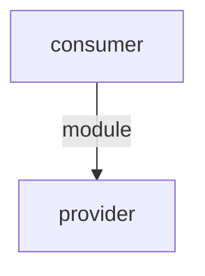

# Dependency Governance

Governa relações declaradas entre módulos — resolução, validação de
compatibilidade, detecção de conflitos e ciclos, e impacto no ciclo de vida
(activate/deactivate/remove). Complementa o [[Service Registry]]:
o Service Registry resolve *o que existe*; a Dependency Governance resolve
*o que um módulo precisa e se pode contar com isso*.

## Declarando uma dependência

Campo novo `dependencies` no `manifest.yaml` — separado do `dependencies`
de `docs/contracts/api.yaml` (que é outro conceito, já existente):

```yaml
dependencies:
  - target:
      type: module          # module | capability
      id: aws_sdk_service
    version_range: ">=1.0.0,<2.0.0"
    required: true
  - target:
      type: capability
      id: aws.cost.read
    required: false
```

- **`type: module`** — depende de um módulo específico pelo `id`.
- **`type: capability`** — depende de *qualquer* serviço que forneça essa
  capability (resolvido via [[Service Registry]], sem acoplar a um `module_id`).
- **`version_range`** — sintaxe de `packaging.specifiers.SpecifierSet`
  (mesma do PyPI: `>=1.0.0,<2.0.0`). Omitido = qualquer versão.
- **`required`** — `true` bloqueia ativação se não satisfeito;
  `false` nunca bloqueia (resolve para `OPTIONAL_UNAVAILABLE` quando ausente).

## Direção obrigatória: Service ✗→ Application

Um Service Module **não pode** depender de um Application Module — só de
outro Service Module, ou de uma capability (que por definição só Service
Modules provêm). Um Application Module pode depender de quantos Service
Modules precisar. Violação é reportada como `INVALID_DEPENDENCY_DIRECTION`
em `techforge validate-module`.

## Estados de resolução

| Estado | Significado |
|---|---|
| `SATISFIED` | Dependência resolvida e compatível. |
| `MISSING` | Alvo não instalado/não encontrado (dependência obrigatória). |
| `INCOMPATIBLE_VERSION` | Alvo encontrado, mas fora do `version_range`. |
| `DISABLED` | Alvo instalado porém desativado. |
| `CONFLICT` | Capability fornecida por mais de um serviço ativo, sem prioridade declarada. |
| `CYCLIC` | Participa de um ciclo de dependências (A→B→...→A). |
| `OPTIONAL_UNAVAILABLE` | Dependência opcional ausente/desativada — nunca bloqueia. |

## Impacto no lifecycle

- **Ativar** um módulo com dependência obrigatória não `SATISFIED` →
  módulo vai para `BLOCKED` (não `INSTALLED`).
- **Desativar/Remover** um módulo com um dependente `INSTALLED` cuja
  dependência obrigatória aponta pra ele → bloqueado.
- Dependências opcionais nunca bloqueiam nenhuma das três operações.

## Grafo e ciclos

O grafo módulo→módulo (dependência de capability resolve pro `module_id`
do provider) é usado para ordem de ativação e detecção de ciclos. Exemplo
gerado a partir de módulos reais de teste (Provider sem dependências,
Consumer dependendo do Provider):



## API e CLI

```bash
GET /api/v1/modules/{id}/dependencies   # dependências resolvidas (com status)
GET /api/v1/modules/{id}/dependents     # quem depende deste módulo
GET /api/v1/dependencies/validate       # valida dependências de todos os módulos instalados
GET /api/v1/dependencies/graph          # { "mermaid": "flowchart TD\n..." }

techforge modules dependencies <id>
techforge modules dependents <id>
techforge modules validate-dependencies
techforge modules graph
```

## Fora de escopo

Download automático de dependências, Marketplace remoto, resolvedor
distribuído, múltiplas versões simultâneas, execução em containers,
autenticação, permissões.
